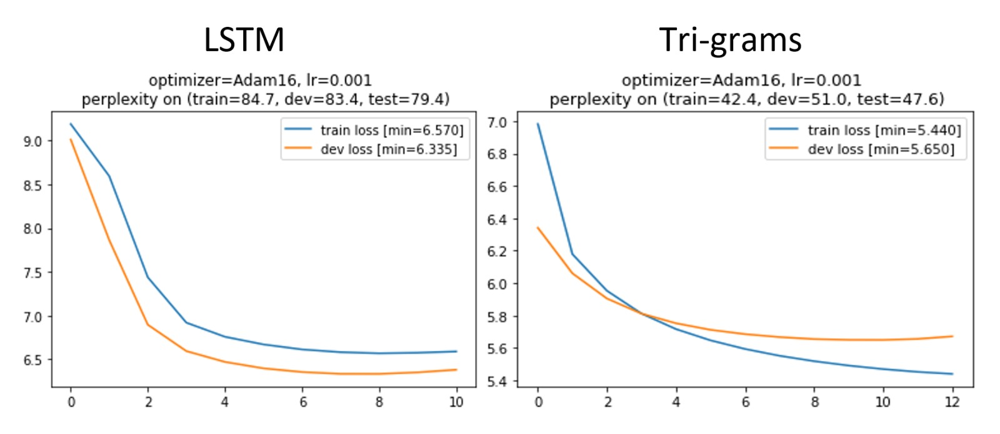

# Deep-learning-for-NLP

## Table of contents

<!--ts-->
   * [Lab1--sentence_classification](LAB1--sentence_classification)
   * [Lab2--language_modeling](Lab2--language_modeling)
<!--te-->

## Lab1--sentence_classification
In this lab we apply two model for sentiment classification, the dataset can be downloaded at: http://caio-corro.fr/dl4nlp/imdb.zip
Both methods use the same hidden representations to pass to the classifier: CBOW and CNN. 

## Lab2--language_modeling

In this lab, we trained two language models: n-gram and LSTM to predict the next token, the objective is to generate sentences with the trained model. 
We use perlexity as the metric to evaluate the two model. 

We have observed quite good results

We note that we used early stopping to avoid overfitting for the n-grams model. The LSTM Model was only
trained for 20 epochs because of the long time it takes, although the loss was still going down.

## Lab3--POS Tagging

To be continue